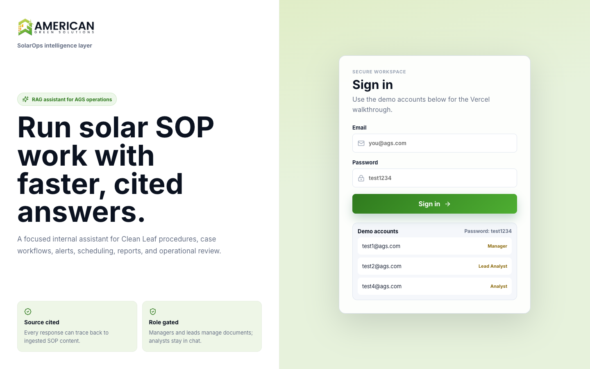
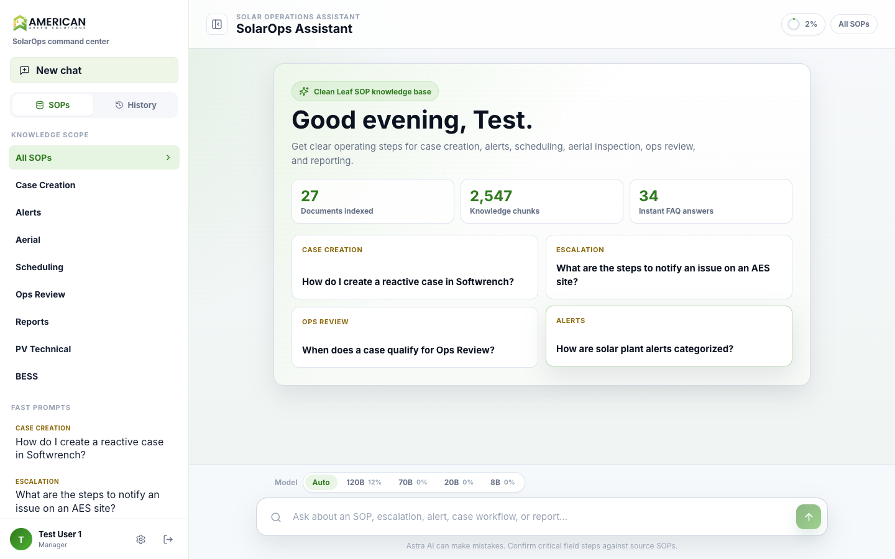
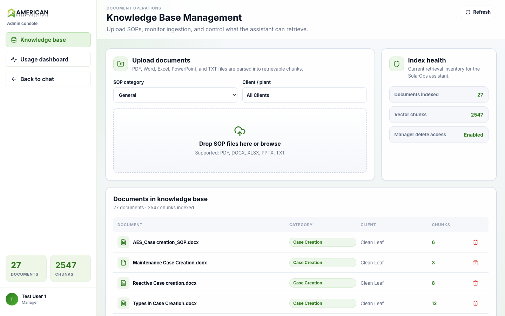

<p align="center">
  
</p>

<h1 align="center">Astra AI — SolarOps Assistant</h1>
<p align="center">
  Internal RAG chatbot for American Green Solutions. Ask a question about a Clean Leaf
  SOP, an alert, a case-creation workflow, or a solar/BESS technical manual — get a
  clean, cited, streamed answer in seconds instead of digging through documents.
</p>

---

## Contents

- [What this is](#what-this-is)
- [Screenshots](#screenshots)
- [Tech stack](#tech-stack)
- [Key features](#key-features)
- [Architecture](#architecture)
- [Project structure](#project-structure)
- [Running it locally](#running-it-locally)
- [Environment variables](#environment-variables)
- [Test accounts](#test-accounts)
- [Knowledge base](#knowledge-base)
- [Deployment](#deployment)
- [Database design (Supabase migration — in progress)](#database-design-supabase-migration--in-progress)
- [Known limitations / open decisions](#known-limitations--open-decisions)

---

## What this is

Monitoring engineers currently hunt through scattered PDFs, Word docs, spreadsheets, and
emails to find the right SOP step, escalation contact, or technical spec. Astra AI reads
all of that — the actual Clean Leaf operating procedures plus a technical library on
solar PV and BESS systems — and answers questions in plain English, citing exactly which
document it pulled from.

It's a **Retrieval-Augmented Generation (RAG)** system: documents are chunked and
embedded into a vector index; a question is embedded the same way; the closest chunks
are retrieved and handed to an LLM (Groq) with strict instructions to answer only from
that material — no invented procedures, no made-up thresholds.

## Screenshots

| Sign in | Chat | Admin — Knowledge base |
|---|---|---|
|  |  |  |

## Tech stack

**Frontend** — React 18 · Vite · React Router · Axios · `fetch`/`ReadableStream` for
token streaming · lucide-react icons

**Backend** — Python 3.13 · FastAPI · Uvicorn · JWT auth (`python-jose`) · Server-Sent
Events for streaming responses

**AI / RAG**
- LLM: [Groq](https://groq.com) — 4 models in a spend-priority chain: `gpt-oss-120b` →
  `llama-3.3-70b-versatile` → `gpt-oss-20b` → `llama-3.1-8b-instant`
- Embeddings: [fastembed](https://github.com/qdrant/fastembed) (ONNX runtime,
  `sentence-transformers/all-MiniLM-L6-v2`, 384-dim) — chosen over the PyTorch
  `sentence-transformers` package specifically because it cuts backend RAM from
  >512MB to ~315MB, which matters on small hosting tiers
- Vector store: [ChromaDB](https://www.trychroma.com) — persistent, pre-built, and
  committed to this repo so a fresh deploy has the full knowledge base with zero
  re-ingestion
- Document parsing: `pdfplumber`, `python-docx`, `openpyxl`/`pandas`, `python-pptx`

## Key features

- **Streaming answers** — token-by-token, like ChatGPT/Claude, not a delayed paste
- **Source citations** — every answer shows which document(s) it's grounded in
- **FAQ semantic cache** — common questions (parsed from the team's Q&A doc) are
  matched by meaning, not exact wording, and answered instantly for **zero LLM tokens**
- **Per-model daily usage budgeting** — each of the 4 Groq models has its own free-tier
  quota; the app spends the best model first and automatically falls over to the next
  when a user's daily budget on that model is used up, with a visible notice
- **Usage dashboard** (admin) — live per-user, per-model token/request consumption,
  plus real numbers pulled straight from Groq's own rate-limit headers
- **Chat history** — a rolling 10-chat queue (oldest auto-evicted) per user, plus a
  permanent 5-slot **favorites** list with rename support
- **Role-based access** — Manager / Lead Analyst / Solar Analyst, enforced on both the
  UI and the API
- **Admin document management** — drag-and-drop upload (PDF/DOCX/XLSX/PPTX/TXT),
  parsed → chunked → embedded → indexed automatically

## Architecture

```
React UI  ──HTTP/SSE──▶  FastAPI (/api)
                              │
                              ▼
                        RAG pipeline
              ┌───────────────┼────────────────┐
              ▼               ▼                ▼
        embed query      vector search    generate answer
        (fastembed,      (ChromaDB,       (Groq — 4-model
         local, free)     cosine)          budget chain)
              │               │                │
              └───────────────┴────────────────┘
                              ▼
                answer + sources, streamed back
```

FAQ questions short-circuit this pipeline entirely (semantic match against a small
cached Q&A set) before any Groq call is made — that's the token-saving path.

## Project structure

```
backend/
├── main.py                    FastAPI app, CORS, startup checks
├── app/
│   ├── auth.py                 JWT issuing/verification, role guards
│   ├── database.py              user accounts + chat history (currently in-memory)
│   ├── usage.py                 per-user/per-model daily quota tracking
│   ├── groq_meta.py              captures Groq's live rate-limit headers
│   ├── routers/                  auth / chat (incl. SSE stream) / docs endpoints
│   ├── ingestion/                 parse → chunk → embed → store pipeline
│   └── rag/
│       ├── embedder.py            fastembed wrapper
│       ├── vector_store.py         ChromaDB access
│       ├── faq.py                  semantic FAQ cache
│       ├── llm.py                  Groq/OpenAI providers, streaming, prompts
│       └── chain.py                 retrieval + generation orchestration
├── chroma_db/                  pre-built vector index (committed — see below)
└── scripts/ingest_books.py     one-off script used to build the technical library

frontend/
├── src/
│   ├── pages/{Login,Chat,Admin}.jsx
│   ├── api/client.js            axios + SSE stream reader
│   └── assets/                   AGS logo assets
└── public/favicon.png

docs/
├── DEPLOY.md                   step-by-step Vercel + Render deploy guide
├── PROJECT.md                    full project write-up
├── astra-schema.dbml              proposed Postgres schema (paste into dbdiagram.io)
└── Astra-AI-Schema-Report.pdf      ER diagram + 3NF normalization analysis
```

## Running it locally

**Backend**
```bash
cd backend
python3 -m venv venv && source venv/bin/activate   # first time only
pip install -r requirements.txt                     # first time only
cp .env.example .env                                 # then add your GROQ_API_KEY
uvicorn main:app --reload --port 8000
```
API docs: <http://localhost:8000/docs> · Health check: <http://localhost:8000/health>

**Frontend**
```bash
cd frontend
npm install      # first time only
npm run dev
```
Open <http://localhost:5173>.

**Or both at once** from the repo root: `./start.sh` (add `stop` / `status` as an
argument to control it). It prints the URL and login once both are up.

## Environment variables

Set these in `backend/.env` (see `backend/.env` for the full annotated template):

| Variable | Required | Purpose |
|---|---|---|
| `GROQ_API_KEY` | Yes, for real AI answers | Free key from [console.groq.com](https://console.groq.com/keys). Without it, the app still runs and returns raw retrieved SOP text. |
| `GROQ_MODEL` / `GROQ_FALLBACK_MODEL` | No | Override the default Groq model IDs |
| `SECRET_KEY` | Recommended for prod | JWT signing secret |
| `ALLOWED_ORIGINS` | For prod | Comma-separated extra CORS origins (e.g. your Vercel URL) |
| `CHROMA_DB_PATH` / `DOCS_UPLOAD_PATH` / `USAGE_DATA_PATH` | No | Override storage paths |

## Test accounts

Password for **all accounts**: `test1234`

| Email | Role |
|---|---|
| `test1@ags.com` | **Manager** — chat, upload/delete docs, full history, usage dashboard |
| `test2@ags.com`, `test3@ags.com` | Lead Analyst — chat, upload docs, full history |
| `test4@ags.com` – `test10@ags.com` | Solar Analyst — chat, own history |

## Knowledge base

Currently indexed: **27 documents, 2,547 chunks, 34 cached FAQ entries.**

| Category | Content |
|---|---|
| Case Creation, Alerts, Aerial, Scheduling, Ops Review, Reports | Real Clean Leaf operating procedures |
| PV Technical, BESS | Solar PV / battery storage technical manuals and best-practice guides |
| FAQ cache | Common technical Q&A, matched semantically so rephrased questions still hit |

Upload more via **Admin → Upload documents** (any role with Manager/Lead access), or
from the command line:
```bash
cd backend
PYTHONPATH=. ./venv/bin/python -c "
from app.ingestion.pipeline import ingest_document
ingest_document('../data/sop-documents/Ops Review.docx', category='Ops Review', client_name='Clean Leaf')
"
```
The vector index (`backend/chroma_db/`) is committed to the repo so every clone/deploy
starts with the full knowledge base already searchable — no re-ingestion required.

## Deployment

Full step-by-step in **[`docs/DEPLOY.md`](docs/DEPLOY.md)**. Current setup used for
testing: **Vercel** (frontend) + **Render free tier** (backend). Render is being
reconsidered — see below.

## Database design (Supabase migration — in progress)

Chat history, usage counters, and user accounts currently live in memory / a local
JSON file, which resets whenever the backend restarts. The team has Supabase Pro and
the plan is to move persistence there. Full schema design — 11 tables, ER diagram,
and a 1NF/2NF/3NF normalization walkthrough — is in
**[`docs/Astra-AI-Schema-Report.pdf`](docs/Astra-AI-Schema-Report.pdf)**
(source: `docs/astra-schema.dbml`, paste into [dbdiagram.io](https://dbdiagram.io/d)
for an interactive version).

**Open question, not yet resolved:** Supabase can own all the *data* (accounts, chat
history, usage, files) cleanly, but the RAG/LLM pipeline is Python and Supabase's
Edge Functions only run JavaScript — so something still has to run that Python code.
Two paths are on the table:
1. Keep the Python backend as-is, host it somewhere other than Render (same code, ~$5–10/mo)
2. Rewrite the RAG pipeline in JavaScript for Supabase Edge Functions (bigger effort,
   real risk around document parsing and the embedding step in that ecosystem)

## Known limitations / open decisions

- **Persistence**: see above — chat history/usage resets on backend restart until the
  Supabase migration lands.
- **Render free tier**: cold-starts after 15 min idle, and previously OOM'd until the
  fastembed swap fixed memory usage — still not meant as the final production host.
- **Token accounting is estimated** where Groq doesn't return exact counts (a rare
  fallback path); the primary path uses Groq's real per-call token counts.
